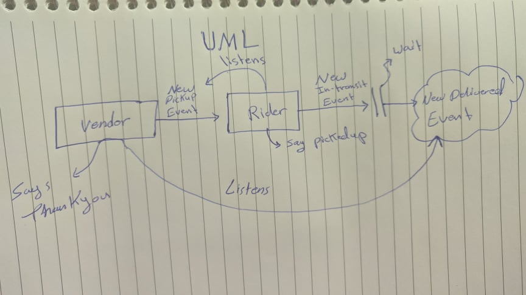

# LAB - Class 17

## Topic: Event Driven Applications

### Author: Muhammed Tommalieh

### Links and Resources

- [submission PR](https://github.com/401-advanced-javascript-tommalieh/caps/pull/2)

### Setup

#### How to initialize/run your application (where applicable)

- e.g.
- `node caps.js`
- `node driver.js`
- `node vendor.js`

#### Tests

- Only visual tests were preformed
- Jest and lint tests we skipped due to not being required for this class

#### UML

